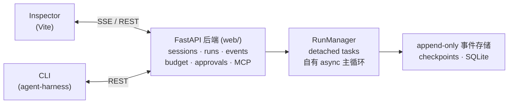

# intelligence-agent

[English](README_EN.md) | 中文

[](LICENSE)
[](pyproject.toml)
[](pyproject.toml)


> 轻量、可观测、可恢复、可插件化的通用 Agent Harness（Python / Async-first），自有主循环，不绑定 LangGraph。

**intelligence-agent** 把 AI agent 当作"耐用的、可完整追踪的会话"来运行：每一次运行都被 checkpoint 保护、可恢复、可重放、可分叉；每一个事件都被持久化并实时推送；预算和审批闸门让 agent 始终在 leash 之内。附带一个暗色三栏 Web 工作台（**Agent Harness Inspector**），实时观看、实时纠偏。

---

## 为什么还需要一个新的 Agent Harness？

大多数 harness 优化的是"把 agent 跑起来"。intelligence-agent 优化的是"把 agent 运营好"：

- **可恢复性优先** —— 运行中途 kill -9，从最后一个 checkpoint 恢复；fork 会话探索不同方案；确定性重放历史。
- **可观测性是核心抽象** —— append-only 的类型化事件流是唯一的真相源；UI 只是它的一个视图。
- **预算纪律** —— 按 run 计量的 token/turn 预算 + 熔断，账单不再是惊喜。
- **人在回路** —— 敏感操作走审批闸门与权限档；queue/steer 可以在不重启的情况下给运行中的 agent 排队新指令或纠偏。

## 功能特性

| 领域 | 能力 |
|---|---|
| **会话与运行** | Session 聚合根（`start` / `resume` / `append`）；RunManager 以 detached task 驱动 run，与 HTTP 生命周期解耦 |
| **可恢复性** | Checkpoint / Resume / Replay / Fork —— 扛住崩溃、支持分支探索、历史可重放 |
| **事件流** | Append-only 类型化 `SessionEvent`；SSE 订阅支持 `after_seq` 断点续订 |
| **预算** | 按 run 的 token & turn 预算、用量台账、熔断器 |
| **审批** | 敏感工具调用前暂停并请求审批；权限档（`GET /api/permission-modes`） |
| **工具** | 内置工具 + **MCP** 服务 + **Skill**（能力渐进披露）+ 沙箱化的 shell/文件执行（`local` / `docker`） |
| **模型层** | 多供应商支持、自动 failover、上下文自动压缩（触发阈值 0.70，硬守卫 0.85） |
| **记忆** | 长期记忆存储 *（可选 extra）* |
| **项目与产物** | 目录即项目；运行产物外置存储 *（可选 extra）* |
| **事中纠偏** | 给运行中的 agent 排队消息或直接 steer，无需重启 |
| **Inspector** | 暗色三栏工作台：Timeline（事件时间线）、Terminal、Overview |

## 快速上手

### 前置要求

- Python ≥ 3.11，[`uv`](https://docs.astral.sh/uv/)
- Node + `pnpm`（仅 Web 工作台需要）

### 1. 安装

```bash
git clone https://github.com/EricKingWhy/intelligence-agent.git
cd intelligence-agent
uv sync --locked            # 全功能加 --all-extras（记忆 / 产物 / docker 沙箱 / 可观测性）
cd web && pnpm install && cd ..
```

### 2. 配置

```bash
cp .env.example .env
# 编辑 .env：填写 MODEL_PROVIDER 和 MODEL_API_KEY
# 支持 deepseek / qwen / senseaudio / mimo / Cline 等，见 .env.example
```

### 3. 启动

```bash
./dev.sh          # 后端 :8000 + 前端 :5173，Ctrl+C 一起停
```

然后打开 **http://127.0.0.1:5173** —— Agent Harness Inspector。

只起后端：

```bash
uv run uvicorn agent_harness.web.app:create_prod_app --factory --host 127.0.0.1 --port 8000
```

### 4. 第一次运行

**CLI：**

```bash
uv run agent-harness "列出当前目录的文件"
uv run agent-harness sessions        # 会话列表
uv run agent-harness fork <id>       # 分叉会话
uv run agent-harness replay <id>     # 重放会话
```

**HTTP（SSE 事件流）：**

```bash
curl -N -X POST http://127.0.0.1:8000/api/sessions \
  -H 'Content-Type: application/json' \
  -d '{"task": "列出当前目录的文件"}'
```

加 `?launch=false` 可以只建会话不启动 run。用 `GET /api/sessions/{id}/stream?after_seq=<n>` 从任意位置续订事件流。

## 核心概念

- **Session（会话）** —— 工作的耐用单元。拥有自己的事件日志、checkpoint、预算和工作区。
- **Run（运行）** —— 会话中的一次执行。Run 是 crash-safe 的：进程被杀后，`POST /recover`（或 CLI）能从最后一个 checkpoint 把会话带回来。
- **事件流** —— 每次状态变更都是一次 append 的类型化事件。没有原地修改；时间线本身就是会话。
- **Fork（分叉）** —— 在任意点分支会话，尝试不同方案，原会话不受影响。
- **Budget（预算）** —— 按 run 设置 token/turn 上限；超限由 harness 叫停，而不是账单给你惊喜。
- **Approval（审批）** —— agent 在执行敏感工具前暂停并请求确认；在 CLI、API 或 Inspector 里 approve/deny。

## Web 工作台 Inspector

`./dev.sh` 在 http://127.0.0.1:5173 起 Inspector（Vite，`/api` 反代到 :8000）。

暗色三栏工作台，围绕事件流构建：

- **Timeline** —— 会话事件历史，实时更新
- **Terminal** —— agent 的 shell 输出，实时可见
- **Overview** —— 预算用量、上下文压力、run 血缘

<!-- 真机截图待补充：在本地跑 ./dev.sh 打开 Inspector 后截图，
     保存为 docs/images/inspector-overview.png，然后取消下一行的注释 -->
<!--  -->

## 配置

配置经 `pydantic-settings` 从 `.env` + 环境变量加载（`src/agent_harness/config.py`）。关键项：

| 变量 | 说明 |
|---|---|
| `MODEL_PROVIDER` / `MODEL_API_KEY` / `MODEL_NAME` / `MODEL_BASE_URL` | 模型接入 |
| `TEMPERATURE` | 采样温度 |
| `JWT_SECRET` | API 鉴权密钥 —— **未配置时 API 无鉴权，仅适合本机/可信网络** |
| `MAX_CONTEXT_TOKENS` | 上下文窗口大小 |
| `AUTO_COMPACT_THRESHOLD` | 自动压缩触发阈值（默认 0.70） |
| `HARD_GUARD_THRESHOLD` | 上下文硬守卫（默认 0.85） |

完整列表见 `.env.example`，包括 `MILVUS_*`（记忆）、`ARTIFACT_STORE_*`（产物）与沙箱选项。

## HTTP API

常用端点（`GET /api/health` 做存活检查）：

| 方法与路径 | 说明 |
|---|---|
| `POST /api/sessions` | 建会话并启动任务（SSE 流） |
| `GET /api/sessions` | 会话列表 |
| `DELETE /api/sessions/{id}` | 删除会话 |
| `POST /api/sessions/{id}/messages` | 追问（queue / steer） |
| `POST /resume` · `POST /forks` · `POST /recover` · `POST /cancel` | 恢复、分叉、崩溃恢复、取消 |
| `GET /api/sessions/{id}/events` · `/stream` | 事件日志 / 实时 SSE 订阅 |
| `POST /api/sessions/{id}/approve` | 批准或拒绝待审批操作 |
| `GET /api/sessions/{id}/budget` · `/context-usage` · `/lineage` | 预算、上下文用量、run 血缘 |
| `GET/POST /api/projects*` | 项目（目录即项目） |
| `GET/POST/PATCH/DELETE /api/memories*` | 长期记忆 *（可选 extra）* |
| `GET/PUT/DELETE /api/model-providers*` | 模型供应商注册表 |

## 架构



后端拥有耐用状态；CLI 和 Web UI 是同一套 API 上的薄客户端。崩溃恢复之所以成立，是因为 run 状态活在 checkpoint 和事件日志里——而不是进程内存里。

## 开发

```bash
uv run pytest -q            # 全量测试
uv run ruff check .          # lint
```

- `integration` / `qiniu` pytest marker 默认不跑（烧 token / 需要真实凭证）。
- `scripts/gate0.py` 是六车道质量门禁（diff-check、ruff、oxlint、tsc、guards、coverage），见 `.github/workflows/`。
- 前端：`cd web && pnpm build`；单测 `vitest`，e2e 用 Playwright。
- 正式工程规格在 `goal/`；`docs/README.md` 是文档导航；ADR 在 `docs/adr/`。

## 路线图

- [ ] 主动式 prompt caching（`cache_control` breakpoint），长会话降本
- [ ] Intervention hooks：事件流中途可阻断 / 改写 / 重试
- [ ] 更聪明的 fork（写时复制工作区）与更细粒度的 resume
- [ ] 更多沙箱后端与更丰富的审批策略

## 贡献

欢迎提 Issue 和 PR。提交 PR 前请先跑 `scripts/gate0.py`；保持改动聚焦——一个 PR 只做一件事。大改动先开 issue 讨论设计。

## 安全

> ⚠️ 未配置 `JWT_SECRET` 时，HTTP API **不做任何鉴权**。只把它暴露在 localhost 或可信网络；不要把无鉴权的实例放到公网。

发现安全漏洞请直接联系维护者（或开一个不含利用细节的 issue），不要在公开 issue 里贴 exploit 细节。

## 许可证

MIT —— 见 [LICENSE](LICENSE)。Copyright (c) 2026 EricWong。

## 致谢

基于 [FastAPI](https://fastapi.tiangolo.com/)、[MCP](https://modelcontextprotocol.io/)、[LangChain Core](https://github.com/langchain-ai/langchain) 等构建。设计上向成熟 agent harness 的可运营性标准看齐——run 在生产环境里应该和 demo 里一样好调试。
