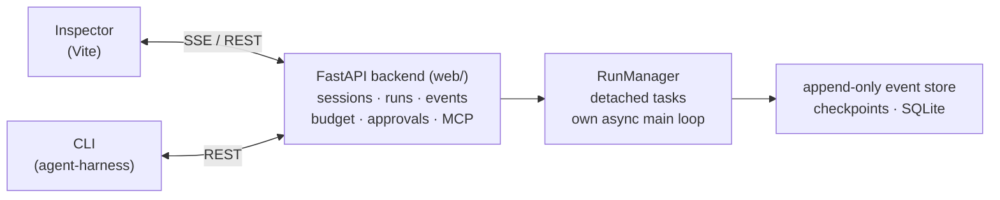

# intelligence-agent

English | [中文](README.md)

[](LICENSE)
[](pyproject.toml)
[](pyproject.toml)


> A lightweight, observable, recoverable, plugin-extensible general-purpose Agent Harness in Python — with its own async main loop (no LangGraph binding).

**intelligence-agent** runs AI agents as durable, fully-traceable sessions: every run is checkpointed, resumable, replayable and forkable; every event is persisted and streamed live; budgets and approval gates keep the agent on a leash. It ships with a dark three-pane web workbench (**Agent Harness Inspector**) for watching and steering runs in real time.

---

## Why another agent harness?

Most harnesses optimize for *starting* an agent. intelligence-agent optimizes for *operating* one:

- **Recoverability first** — kill -9 mid-run, resume from the last checkpoint; fork a session to explore alternatives; replay history deterministically.
- **Observability as the core abstraction** — an append-only typed event stream is the single source of truth; the UI is just a view over it.
- **Budget discipline** — token/turn budgets with circuit breakers, enforced per run.
- **Human-in-the-loop** — approval gates and permission modes for sensitive actions; queue/steer to redirect a running agent without restarting it.

## Features

| Area | What you get |
|---|---|
| **Sessions & Runs** | Session aggregate root (`start`/`resume`/`append`); runs driven by a RunManager in detached tasks, decoupled from HTTP lifecycle |
| **Recovery** | Checkpoint / Resume / Replay / Fork — survive crashes, explore branches, re-run history |
| **Event stream** | Append-only typed `SessionEvent`s; subscribe over SSE with `after_seq` breakpoint resume |
| **Budget** | Per-run token & turn budgets, usage ledger, circuit breaker |
| **Approvals** | Approval gates for sensitive tool calls; permission modes (`GET /api/permission-modes`) |
| **Tools** | Built-in tools + **MCP** servers + **Skills** (progressive capability disclosure) + sandboxed shell/file execution (`local`/`docker`) |
| **Model layer** | Multi-provider support, automatic failover, context auto-compaction (threshold 0.70, hard guard 0.85) |
| **Memory** | Long-term memory store *(optional extra)* |
| **Projects & Artifacts** | A directory is a project; run artifacts stored externally *(optional extra)* |
| **Steering** | Queue follow-up messages or steer a live run without restarting it |
| **Inspector UI** | Dark three-pane workbench: Timeline (event stream), Terminal, Overview |

## Quickstart

### Prerequisites

- Python ≥ 3.11, [`uv`](https://docs.astral.sh/uv/)
- Node + `pnpm` (only for the web workbench)

### 1. Install

```bash
git clone https://github.com/EricKingWhy/intelligence-agent.git
cd intelligence-agent
uv sync --locked            # add --all-extras for memory / artifacts / docker sandbox / observability
cd web && pnpm install && cd ..
```

### 2. Configure

```bash
cp .env.example .env
# edit .env: set MODEL_PROVIDER and MODEL_API_KEY
# (providers include deepseek / qwen / senseaudio / mimo / Cline — see .env.example)
```

### 3. Run

```bash
./dev.sh          # backend :8000 + frontend :5173, Ctrl+C stops both
```

Then open **http://127.0.0.1:5173** — the Agent Harness Inspector.

Backend only:

```bash
uv run uvicorn agent_harness.web.app:create_prod_app --factory --host 127.0.0.1 --port 8000
```

### 4. Your first run

**CLI:**

```bash
uv run agent-harness "List the files in the current directory"
uv run agent-harness sessions        # list sessions
uv run agent-harness fork <id>       # fork a session
uv run agent-harness replay <id>     # replay a session
```

**HTTP (streams events over SSE):**

```bash
curl -N -X POST http://127.0.0.1:8000/api/sessions \
  -H 'Content-Type: application/json' \
  -d '{"task": "List the files in the current directory"}'
```

Add `?launch=false` to create a session without starting a run. Resume a live event stream from any point with `GET /api/sessions/{id}/stream?after_seq=<n>`.

## Core concepts

- **Session** — the durable unit of work. Owns its event log, checkpoints, budget and workspace.
- **Run** — one execution attempt inside a session. Runs are crash-safe: kill the process and `POST /recover` (or the CLI) brings the session back from its last checkpoint.
- **Event stream** — every state change is an appended typed event. Nothing is mutated in place; the timeline *is* the session.
- **Fork** — branch a session at any point to try a different approach while keeping the original intact.
- **Budget** — set token/turn limits per run; the harness stops the run instead of the invoice surprising you.
- **Approvals** — the agent pauses and asks before running sensitive tools; approve/deny from the CLI, API or Inspector.

## Web Inspector

`./dev.sh` serves the Inspector at http://127.0.0.1:5173 (Vite, `/api` proxied to :8000).

A dark, three-pane workbench built around the event stream:

- **Timeline** — the session's event history, live-updating
- **Terminal** — the agent's shell output as it happens
- **Overview** — budget usage, context pressure, run lineage

<!-- Real screenshots TODO: run ./dev.sh locally, capture the Inspector,
     save as docs/images/inspector-overview.png, then uncomment the line below -->
<!--  -->

## Configuration

Settings are loaded via `pydantic-settings` from `.env` + environment variables (`src/agent_harness/config.py`). Key knobs:

| Variable | Purpose |
|---|---|
| `MODEL_PROVIDER` / `MODEL_API_KEY` / `MODEL_NAME` / `MODEL_BASE_URL` | Model access |
| `TEMPERATURE` | Sampling temperature |
| `JWT_SECRET` | API auth secret — **if unset, the API runs without authentication (local/trusted network only)** |
| `MAX_CONTEXT_TOKENS` | Context window size |
| `AUTO_COMPACT_THRESHOLD` | Auto-compaction trigger (default 0.70) |
| `HARD_GUARD_THRESHOLD` | Hard context guard (default 0.85) |

See `.env.example` for the full list, including `MILVUS_*` (memory), `ARTIFACT_STORE_*` (artifacts) and sandbox options.

## HTTP API

Selected endpoints (`GET /api/health` for a liveness check):

| Method & Path | Description |
|---|---|
| `POST /api/sessions` | Create session and launch task (SSE stream) |
| `GET /api/sessions` | List sessions |
| `DELETE /api/sessions/{id}` | Delete a session |
| `POST /api/sessions/{id}/messages` | Continue the conversation (queue / steer) |
| `POST /resume` · `POST /forks` · `POST /recover` · `POST /cancel` | Resume, fork, crash-recover, cancel |
| `GET /api/sessions/{id}/events` · `/stream` | Event log / live SSE subscription |
| `POST /api/sessions/{id}/approve` | Approve or deny a pending action |
| `GET /api/sessions/{id}/budget` · `/context-usage` · `/lineage` | Budget, context pressure, run lineage |
| `GET/POST /api/projects*` | Projects (a directory is a project) |
| `GET/POST/PATCH/DELETE /api/memories*` | Long-term memory *(optional extra)* |
| `GET/PUT/DELETE /api/model-providers*` | Model provider registry |

## Architecture



The backend owns durable state; the CLI and the web UI are thin clients over the same API. Crash recovery works because run state lives in checkpoints and the event log — never only in process memory.

## Development

```bash
uv run pytest -q            # full test suite
uv run ruff check .          # lint
```

- `integration` / `qiniu` pytest markers are off by default (they burn tokens or need real credentials).
- `scripts/gate0.py` is the six-lane quality gate (diff-check, ruff, oxlint, tsc, guards, coverage) — see `.github/workflows/`.
- Frontend: `cd web && pnpm build`; unit tests via `vitest`, e2e via Playwright.
- The formal engineering spec lives in `goal/`; `docs/README.md` is the docs index; ADRs in `docs/adr/`.

## Roadmap

- [ ] Proactive prompt caching (`cache_control` breakpoints) for long-running sessions
- [ ] Intervention hooks: block / rewrite / retry events mid-stream
- [ ] Smarter fork (copy-on-write workspaces) and finer-grained resume
- [ ] More sandbox backends and richer approval policies

## Contributing

Issues and PRs are welcome. Please run `scripts/gate0.py` before submitting a PR, and keep changes scoped — one concern per PR. For larger proposals, open an issue first to discuss the design.

## Security

> ⚠️ If `JWT_SECRET` is not configured, the HTTP API performs **no authentication**. Only expose the server on localhost or a trusted network. Never put an unauthenticated instance on the public internet.

To report a vulnerability, please contact the maintainer directly (or open an issue without exploit details) rather than filing a public issue with exploit details.

## License

MIT — see [LICENSE](LICENSE). Copyright (c) 2026 EricWong.

## Acknowledgments

Built with [FastAPI](https://fastapi.tiangolo.com/), [MCP](https://modelcontextprotocol.io/), [LangChain Core](https://github.com/langchain-ai/langchain) and friends. Inspired by the operability standards of mature agent harnesses — runs should be as debuggable in production as they are fun in a demo.
